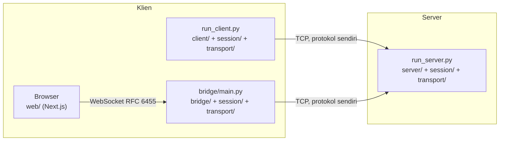
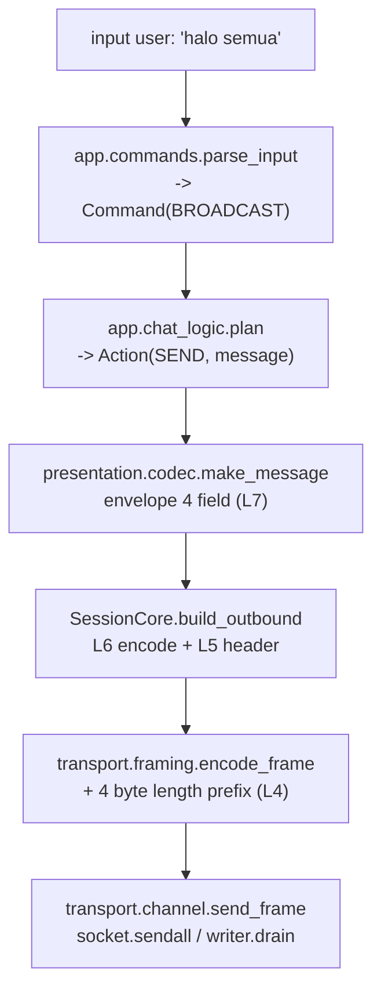
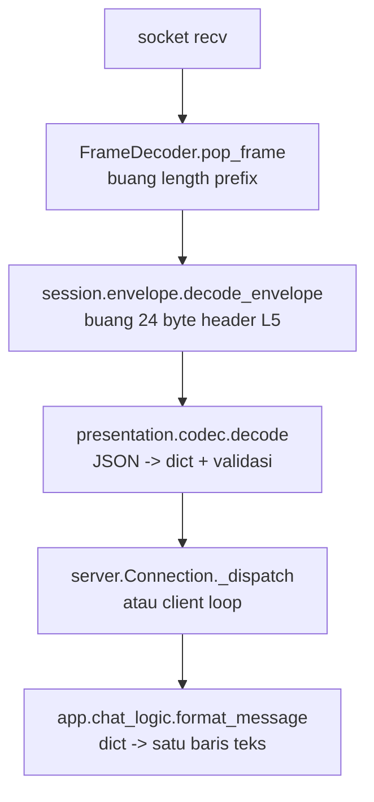
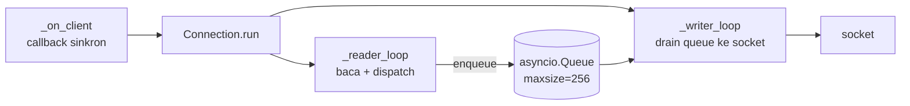
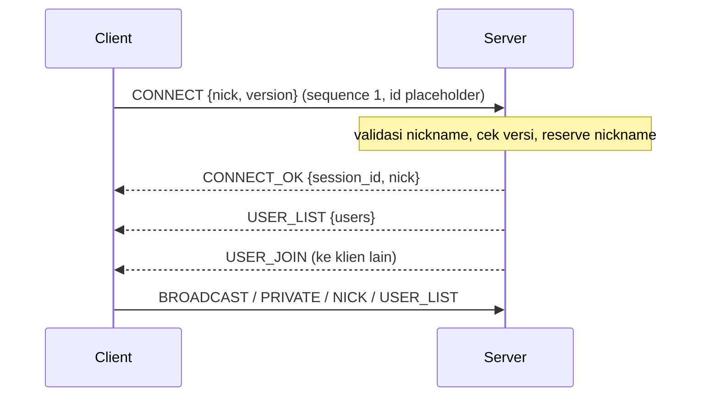
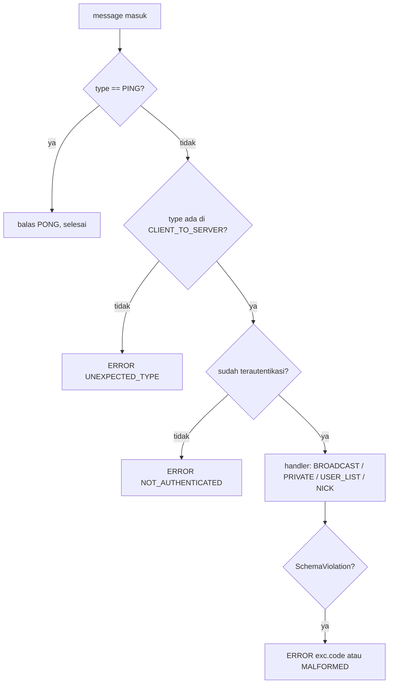
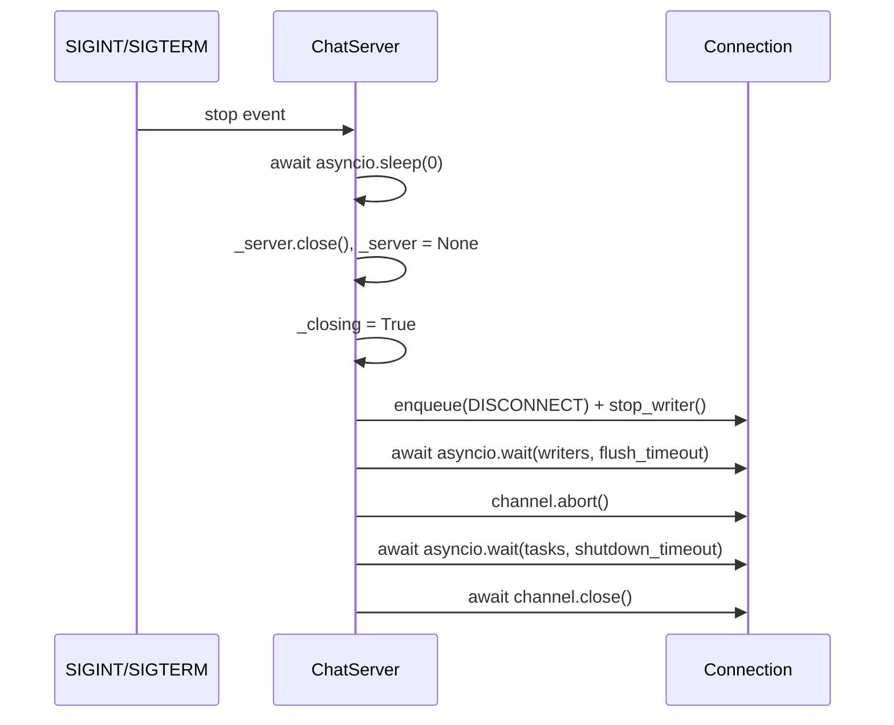

# Arsitektur Sistem Chat

Dokumen ini menjelaskan bagaimana aplikasi chat multi-user ini disusun: pembagian
lapisan, alur satu pesan dari tombol Enter sampai ke layar penerima, dan alasan di
balik setiap keputusan desain yang terlihat di kode. Pembaca yang dituju adalah
anggota tim yang perlu memodifikasi kode, dosen yang menilai, dan siapa pun yang
ingin memahami mengapa protokol ini berbentuk seperti ini. Semua yang ditulis di
sini bisa diverifikasi langsung di repositori; tidak ada fitur yang dijelaskan di
sini yang tidak ada di kode.

---

## 1. Ringkasan sistem

Ada tiga proses yang bisa dijalankan, dan satu protokol yang dipakai bersama oleh
ketiganya.

| Proses | Berkas masuk | Peran |
| --- | --- | --- |
| Chat server | `run_server.py` | Menerima koneksi TCP, mengelola daftar user, menyebarkan pesan |
| CLI client | `run_client.py` | Klien terminal, dua thread: keyboard dan socket |
| Bridge | `bridge/main.py` | Jembatan WebSocket (browser) ke TCP (server chat) |

Server adalah satu-satunya pemegang otoritas: ia yang menetapkan nickname,
menandai waktu, dan menentukan ke mana pesan disebarkan. Klien tidak pernah
dipercaya untuk hal-hal itu.



Bridge tidak punya aturan chat sendiri. Ia mengimpor `app/commands.py` dan
`app/chat_logic.py` yang sama dengan CLI client, jadi `/nick`, `/msg`, dan `/list`
berperilaku identik di kedua klien. Bridge juga mengimpor `session/` dan
`presentation/` langsung, sehingga format kabelnya tidak mungkin berbeda dari
yang dipakai CLI.

---

## 2. Peta modul

Setiap lapisan adalah paketnya sendiri. Ketergantungan hanya mengalir satu arah:
lapisan atas mengimpor lapisan bawah, tidak sebaliknya.

| Paket | Lapisan | Isi |
| --- | --- | --- |
| `transport/` | L4 | `BlockingTcpChannel`, `AsyncTcpChannel`, `FrameDecoder`, `encode_frame`, `MAX_FRAME_SIZE` |
| `session/` | L5 | `SessionCore`, `ClientSession`, `encode_envelope`, `decode_envelope`, `HeartbeatPolicy`, `build_connect` |
| `presentation/` | L6 | `make_message`, `encode`, `decode`, `validate_message`, `MessageType`, `ErrorCode` |
| `app/` | L7 | `parse_input`, `plan`, `format_message`, konfigurasi bersama |
| `server/` | L7 (host) | `ChatServer`, `Connection`, `UserRegistry`, logging |
| `client/` | L7 (host) | `open_session`, `Receiver`, `Ui`, entry point CLI |
| `bridge/` | L7 (host) | `BridgeServer`, `BridgeClient`, WebSocket tulis tangan, `ChatConnection` |
| `trace/` | lintas lapisan | `TraceEmitter`, `TraceEvent`, sink untuk CLI dan visualizer |
| `util/` | tanpa lapisan | `utc_now`, `to_iso8601`, `parse_iso8601`, `hex_dump` |
| `tools/` | operasional | `frame_dump.py`, `stress_test.py`, `scenarios.py` |
| `tests/` | — | `unittest`, satu modul per area |

`app/` sengaja tidak melakukan I/O sama sekali. `plan()` mengubah satu baris input
menjadi satu `Action`, dan `format_message()` mengubah satu envelope masuk menjadi
satu baris teks. Karena keduanya fungsi murni, CLI, bridge, dan test bisa berbagi
perilaku yang sama persis — dan bahasa perintah klien hanya punya satu definisi,
bukan dua yang bisa berbeda.

---

## 3. Alur satu pesan

### 3.1 Turun: dari input user ke byte



`build_outbound` adalah satu langkah yang di dalamnya menjalankan dua lapisan
sekaligus: `presentation.codec.encode` (L6) menghasilkan byte JSON, lalu
`session.envelope.encode_envelope` (L5) menambahkan header 24 byte. Keduanya
tidak dipanggil terpisah dari luar — itu sebabnya keduanya digambar sebagai satu
kotak.

Yang penting di sini: setiap lapisan menambahkan header-nya sendiri, dan tidak ada
lapisan yang mengintip isi lapisan lain. `transport/` tidak pernah mem-parse JSON;
`presentation/` tidak pernah melihat socket.

### 3.2 Naik: dari byte ke layar



Urutannya cermin dari arah turun, dan itulah yang membuat enkapsulasi bisa
diklaim: `7b 22` (awalan `{"`) baru muncul di offset 28 pada frame body, karena
24 byte sebelumnya milik lapisan sesi.

### 3.3 Format frame di kabel

```
+----------------+----------------------+---------------------------+
| 4 byte prefix  | 24 byte header L5    | payload JSON UTF-8        |
| big-endian u32 | 16 byte UUID + 8 u64 | presentation layer        |
+----------------+----------------------+---------------------------+
 offset 0         offset 4               offset 28
```

| Offset | Ukuran | Isi | Lapisan |
| --- | --- | --- | --- |
| 0 | 4 | panjang payload (header L5 + JSON), big-endian | L4 |
| 4 | 16 | session id, byte UUID mentah | L5 |
| 20 | 8 | sequence number, uint64 big-endian | L5 |
| 28 | sisa | envelope JSON | L6 |

Length prefix menghitung header sesi, sequence, dan JSON — yaitu semua yang ada
setelah prefix 4 byte itu sendiri. Konstanta terkait: `LENGTH_PREFIX_SIZE = 4` dan
`MAX_FRAME_SIZE = 64 * 1024` di `transport/framing.py`; `SESSION_HEADER_SIZE = 24`
di `session/envelope.py`.

Sequence number mulai dari 1 untuk kedua arah. Nilai 0 disediakan sebagai penanda
"belum ada pesan terkirim" dan bukan nomor yang dipakai untuk trafik normal —
`session/envelope.py` mendefinisikannya lewat `MAX_SEQUENCE` dengan rentang legal
`0..MAX_SEQUENCE`, dan `session/session.py` memulai counter di 1. Karena itu frame
`CONNECT` yang pertama pun sudah membawa sequence 1. Session id sebelum handshake
memakai placeholder
`UNASSIGNED_SESSION_ID = "00000000-0000-0000-0000-000000000000"`.

---

## 4. Keputusan desain

### 4.1 TCP (`SOCK_STREAM`), bukan UDP

Chat butuh pengiriman yang andal dan berurutan. Satu pesan yang hilang atau
tertukar urutannya adalah pesan yang salah tampil, dan protokol aplikasi harus
menambal sendiri hal itu di atas UDP — pekerjaan yang tidak memberi nilai apa pun
untuk kasus ini. Konsekuensi yang harus diterima jujur: TCP menambah latensi
handshake dan menyimpan state per koneksi di kernel, dan protokol ini tidak
dirancang untuk broadcast massal dengan ribuan penerima.

### 4.2 Length prefix, bukan delimiter newline

JSON boleh memuat `\n` di dalam string, jadi protokol ber-delimiter harus
melarang atau meng-escape karakter itu. Length prefix menyelesaikan pertanyaan
"pesan ini berakhir di mana" dalam empat byte pertama, dan itu membeli tiga hal
yang disebutkan eksplisit di `transport/framing.py`:

1. **Alokasi dibatasi sebelum payload ada.** Decoder menolak frame yang terlalu
   besar hanya dari prefix-nya, sebelum satu byte payload pun disangga. Dengan
   delimiter, peer yang berniat buruk bisa membuat penerima menumpuk buffer tanpa
   batas hanya dengan tidak pernah mengirim delimiter.
2. **Tidak ada escaping.** Payload tetap JSON biasa, sehingga bisa dibaca langsung
   di Wireshark dan disalin ke test fixture.
3. **Framing lepas dari semantik payload.** Payload yang rusak adalah urusan L6
   dan tidak bisa merusak batas frame pesan di sekitarnya.

Biayanya empat byte per pesan, ditambah keharusan kedua sisi sepakat soal urutan
byte. Big-endian dipilih karena itu yang diharapkan pembaca hex view.

### 4.3 Server: satu event loop `asyncio`

Server memakai satu event loop, bukan satu thread per klien. Alasannya bukan
"asyncio lebih cepat", melainkan karena state bersama server ini adalah roster,
dan setiap operasinya adalah baca/tulis `dict` biasa. Di satu event loop,
operasi-operasi itu atomik secara konstruksi — tidak ada satu pun method di
`UserRegistry` yang `await` — sehingga roster tidak butuh lock dan tidak bisa
terbaca dalam keadaan setengah jadi.



Invarian yang dijaga roster: **satu nickname hanya boleh dipetakan ke satu sesi,
dan satu sesi hanya boleh punya satu nickname.** Kedua arah disimpan bersamaan di
`_by_nickname` dan `_by_session` supaya tidak bisa saling menyimpang.

Trade-off yang harus disebut: desain satu loop membuat satu klien lambat berpotensi
menghambat semua orang. Itu dijawab oleh queue per koneksi, bukan oleh thread.

### 4.4 Kebijakan slow consumer

Setiap koneksi punya `asyncio.Queue` sendiri dengan `DEFAULT_SEND_QUEUE_SIZE = 256`.
`Connection.enqueue()` memakai `put_nowait`, dan saat queue penuh ia mencatat
peringatan lalu memanggil `abort()` — membuang seluruh isi queue dan menutup socket
saat itu juga.

`enqueue` sengaja non-blocking karena ia berjalan di jalur broadcast: kalau ia
`await`, satu klien yang berhenti membaca akan menahan pengiriman ke semua klien
lain. `abort()` dikhususkan untuk kasus ini. Akhir koneksi yang wajar tidak lewat
`abort()`, melainkan lewat `_teardown()` yang lebih dulu menguras queue supaya peer
sempat diberi tahu alasannya. `stop_writer()` selalu memasukkan sentinel `None`,
bahkan bila itu berarti menggeser satu pesan keluar, karena writer task yang
terparkir selamanya di `queue.get()` justru yang ditunggu oleh teardown.

### 4.5 Klien: `threading`, dua thread

Klien CLI memakai dua thread, dan itu bukan pilihan gaya. `input()` memblokir dan
tidak bisa dibatalkan maupun di-poll, jadi thread utama tidak mungkin sekaligus
melayani socket. Thread pembaca memegang socket; thread utama memegang keyboard.
Kurang dari dua thread berarti satu arah kelaparan, yang justru hal yang ingin
dihindari.

Ctrl+C ditangani dengan membiarkan `KeyboardInterrupt` naik keluar dari `input()`,
bukan lewat signal handler yang menyetel flag. Handler yang hanya menyetel flag
tidak mengakhiri pembacaan yang sedang memblokir — CPython akan mencoba syscall
itu lagi — sehingga user menekan Ctrl+C dan tidak melihat apa-apa sampai ia juga
menekan Enter. Eksepsi itu datang di thread utama di antara dua pembacaan, tepat
di titik yang aman untuk keluar, dan blok `finally` tetap mengucapkan selamat
tinggal.

Server dan klien sengaja tidak simetris di sini: server tidak punya `input()`
yang memblokir, dan registry-nya untung dari loop tunggal.

### 4.6 Header sesi 24 byte di antara L4 dan L6

Header biner ini menjaga L5 (identitas sesi dan urutan) tetap lepas dari L6
(serialisasi). Kalau format payload berubah — misalnya dari JSON ke MessagePack —
lapisan sesi tidak perlu ikut berubah. Alasan kedua ada di `session/envelope.py`:
header biner membuat pelapisan tidak bisa dibantah. Kalau header sesi juga JSON,
frame akan jadi satu gumpalan JSON yang tidak bisa dibedakan, dan klaim "setiap
lapisan menambahkan header sendiri" tidak bisa diverifikasi dengan melihat byte.

### 4.7 Server menimpa `sender` dan `timestamp`

Server menimpa field `sender` dengan nickname yang sudah ditetapkan saat
handshake, dan ia sendiri yang menstempel `timestamp`. Ini mencegah spoofing —
klien tidak bisa mengaku sebagai user lain — dan membuat waktu otoritatif ada di
satu tempat. Klien tetap mengisi `sender` saat membangun pesan, tetapi nilai itu
hanya dipakai untuk trace dan tampilan sebelum server menjawab.

### 4.8 Asimetri pesan pribadi

Saat `PRIVATE` dikirim, salinan untuk pengirim membawa field `to`, sedangkan
salinan untuk penerima tidak. Perbedaan inilah yang memungkinkan satu tipe pesan
dirender dua arah: `format_message` melihat `to == nickname` dan menyimpulkan
"ini pesan saya yang keluar", sedangkan penerima melihatnya sebagai pesan pribadi
masuk tanpa perlu tipe pesan kedua.

### 4.9 Koneksi yang ditolak dibatalkan, bukan ditutup rapi

Saat server penuh atau sedang shutdown, `_on_client` memanggil
`writer.transport.abort()` dan tidak melakukan close handshake. Tidak ada gunanya
bernegosiasi dengan peer yang tidak bisa dilayani, dan `close()` yang rapi
dijadwalkan di loop yang mungkin tidak akan berjalan satu iterasi lagi.

### 4.10 Ganti nickname bukan handshake kedua

`NICK` tidak mereset session id maupun sequence number. Yang berubah hanya nama
tampilan di registry. User lain diberi tahu lewat pasangan `USER_LEAVE` (nama lama)
dan `USER_JOIN` (nama baru), bukan lewat tipe pesan khusus — sehingga klien yang
hanya mengenal tipe pesan awal tetap merender perubahan itu dengan benar: satu user
pergi, satu user datang. Meminta nickname yang sama persis akan dijawab `NICK_OK`
tanpa menyentuh registry sama sekali.

---

## 5. Siklus hidup koneksi

### 5.1 Handshake



Versi protokol yang berlaku adalah `PROTOCOL_VERSION = 1`. Ketidakcocokan versi
ditolak saat handshake, bukan ditemukan belakangan sebagai frame yang tidak bisa
dijelaskan. `USER_LIST` boleh datang sebelum atau sesudah `CONNECT_OK`; klien
dengan sabar membaca sampai frame yang benar-benar menentukan hasilnya muncul.

### 5.2 Urutan dispatch di server



`PING` dilayani sebelum pemeriksaan autentikasi, dan itu disengaja: keepalive
adalah urusan lapisan sesi, dan peer yang belum selesai handshake tetap perlu
dijawab supaya tidak dianggap mati.

### 5.3 Shutdown



Dua hal di metode ini punya alasan yang tertulis di docstring sumbernya dan layak
diulang.

**Baris `await asyncio.sleep(0)` di awal bukan hiasan.** `asyncio.Server` menerima
koneksi dalam dua langkah: selector membaca koneksi lalu menjalankan
`_accept_connection2` sebagai task, dan baru task itulah yang membangun transport
dan memanggil callback protokol. Menutup listener di tick yang sama berarti
mendarat di antara keduanya: `Server._attach` menjalankan
`assert self._sockets is not None` terhadap server yang baru saja menyetel field
itu ke `None`, task-nya melempar, dan socket yang sudah diterima terbuang tanpa
ada yang memegang referensinya untuk ditutup. Memberi satu giliran loop membuat
accept yang sedang berjalan sempat mendaftar, sehingga koneksi itu sampai ke
`_on_client` dan ditolak lewat jalur `_closing` yang normal.

**`self._server.wait_closed()` sengaja tidak di-await.** Mulai Python 3.13, method
itu juga menunggu setiap handler koneksi yang masih hidup selesai, sementara
handler-handler itu sedang terparkir di `receive_frame` menunggu peer yang belum
pergi — ia akan deadlock melawan koneksi yang justru sedang ditutup oleh method
ini.

**`asyncio.Server.serve_forever()` tidak dipakai sama sekali.** Ini temuan dari
pengujian jalur Ctrl+C, bukan pilihan gaya. Sejak Python 3.14, membatalkan task
yang meng-await method itu menjalankan tiga hal sebelum cancellation-nya
merambat keluar:

```python
except exceptions.CancelledError:
    try:
        self.close()
        self.close_clients()          # <- menutup transport SETIAP klien
        await self.wait_closed()
    finally:
        raise
```

`close_clients()` menutup socket setiap klien yang sedang terhubung. Pada jalur
nyata, `server/main.py` menghentikan accept loop dengan `serve.cancel()` **sebelum**
`shutdown()` dipanggil, jadi urutannya menjadi: transport klien ditutup dulu,
baru `DISCONNECT` dimasukkan ke queue. Writer mengambil farewell itu, mencoba
menulis ke transport yang sudah `closing`, dan `send_frame` melempar
`ConnectionClosedError` — yang ditangkap `_writer_loop` sebagai `return` normal
tanpa log apa pun. Hasilnya: farewell hilang tanpa jejak dan klien melihat
`connection closed by peer` alih-alih `DISCONNECT`, persis seperti server yang
crash. Inilah sebabnya log shutdown lama menulis `0 client(s) connected`
sementara satu klien masih terhubung.

Karena itu `serve_forever()` di kelas ini memanggil `start_serving()` langsung
lalu parkir di `asyncio.Event().wait()` sampai task-nya dibatalkan. Tidak ada
yang menutup socket klien selain `shutdown()`, sehingga urutan
queue-farewell-dulu-baru-tutup tetap utuh.

Selama proses itu, `_forget()` tidak lagi menyiarkan `USER_LEAVE` per koneksi:
semua orang keluar bersamaan dan sudah diberi tahu lewat `DISCONNECT`, jadi
satu pesan per koneksi hanya akan jadi ledakan kebisingan tentang roster yang
sudah tidak ada.

---

## 6. Penanganan kegagalan

| Kejadian | Perlakuan | Kode/aksi |
| --- | --- | --- |
| Klien mati mendadak (RST) | `ConnectionResetError`/`ConnectionAbortedError`/`BrokenPipeError` dipetakan ke `ConnectionClosedError`, dicatat sebagai INFO | bukan kesalahan server |
| EOF di tengah frame | `_eof_message()` menyebutkan frame yang terpotong bila `decoder.buffered_bytes` tidak nol | `ConnectionClosedError` |
| Frame melebihi batas | Ditolak dari length prefix saja, sebelum payload disangga | `FRAME_TOO_LARGE`, koneksi ditutup |
| Frame tidak bisa didekode | Dihitung; satu frame buruk masih bisa dipulihkan | `MALFORMED` |
| Tiga frame buruk berturut-turut | Budget habis (`DEFAULT_MALFORMED_BUDGET = 3`) | `MALFORMED` lalu tutup |
| Session id di header tidak cocok | Dihitung sebagai malformed; menerima id sesi lain akan membuat header itu sekadar hiasan | `MALFORMED` |
| Timeout handshake | `asyncio.wait_for` dengan `handshake_timeout` | INFO, koneksi ditutup |
| Server penuh | Ditolak di `_on_client`, socket dibatalkan | `SERVER_FULL` ada di kosakata |
| Pesan pribadi ke user tidak ada | Dijawab, koneksi tetap hidup | `NO_SUCH_USER` |
| Queue kirim penuh | Slow consumer dibuang | log + `abort()` |
| Frame keluar terlalu besar | Dicatat dan pesan dibuang, koneksi dipertahankan — ini bug build, bukan sesuatu yang bisa diperbaiki peer | log ERROR |
| Eksepsi tak terduga di satu koneksi | Ditangkap dengan `except Exception`, dicatat dengan traceback | koneksi lain tidak terpengaruh |

Prinsipnya satu: **satu koneksi tidak boleh mematikan server.** Karena itu blok
`except Exception` yang lebar di `Connection.run()` disengaja, dan pembersihan ada
di `finally`, bukan di jalur eksepsi.

### Liveness

TCP tidak memberi tahu dengan cepat bahwa peer sudah hilang. Kalau sebuah mesin
kehilangan daya, socket tetap terlihat terbuka dan bisa ditulisi dari sisi lokal,
dan kernel baru memeriksanya sekitar dua jam kemudian. Karena itu liveness
ditegakkan di lapisan aplikasi.

`HeartbeatPolicy` default: `interval = 15.0` detik dan `timeout = 45.0` detik —
timeout tepat tiga kali interval, sehingga peer masih diberi beberapa kesempatan
menjawab PING sebelum dinyatakan hilang. `HeartbeatPolicy.__post_init__` menolak
`timeout` yang tidak lebih besar dari `interval`, jadi rasio ini bukan sekadar
konvensi. Klien dan server memakai faktor `HEARTBEAT_TIMEOUT_FACTOR = 3.0` yang
sama, jadi kedua sisi menyerah pada jadwal yang sama. Biayanya jujur: satu putaran
PING/PONG per `interval` detik untuk setiap koneksi yang menganggur.
`SO_KEEPALIVE` tidak menelan biaya per pesan, tetapi terlalu lambat dan ambangnya
tidak portabel.

---

## 7. Konfigurasi

Tidak ada alamat yang di-hardcode di luar `app/config.py`. Urutan prioritas:
flag baris perintah > variabel lingkungan > default.

| Variabel | Default | Dipakai oleh |
| --- | --- | --- |
| `CHAT_HOST` | `127.0.0.1` | server dan klien |
| `CHAT_PORT` | `9009` | server dan klien |
| `CHAT_MAX_CLIENTS` | `64` | server |
| `CHAT_HEARTBEAT_INTERVAL` | `15.0` | server dan klien |
| `CHAT_NICK` | (kosong) | klien CLI |
| `CHAT_BRIDGE_HOST` | `127.0.0.1` | bridge (sisi browser) |
| `CHAT_BRIDGE_PORT` | `8787` | bridge (sisi browser) |
| `TRACE_ENABLED` | (mati) | semua komponen |

`127.0.0.1` dipilih sebagai default, bukan wildcard address, karena
menghubungkan klien ke `0.0.0.0` adalah salah konfigurasi yang pesan
kegagalannya ("connection refused") tidak menjelaskan apa-apa.

Pembaca nilai memakai helper `env_str`, `env_int`, `env_float`, dan `env_flag`.
Nilai yang salah format jatuh ke default alih-alih melempar: orang yang menulis
`CHAT_PORT=abc` perlu programnya tetap jalan supaya bisa melihat variabel mana
yang salah, bukan traceback yang tidak menyebut keduanya. Untuk `env_flag`,
penulisan yang dianggap benar adalah `1`, `true`, `yes`, dan `on`
(tidak peka huruf besar-kecil).

Contoh menjalankan:

```bash
# Server
python run_server.py --host 0.0.0.0 --port 9009 --trace

# Dua klien CLI
python run_client.py --host 127.0.0.1 --port 9009 --nick budi
python run_client.py --host 127.0.0.1 --port 9009 --nick sari

# Bridge untuk browser
python -m bridge.main --host 127.0.0.1 --port 9009 --ws-port 8787
```

---

## 8. Observability

Ada dua jalur keluaran, dan keduanya menjawab pertanyaan yang berbeda.

**Log server** (`server/logger.py`) adalah pandangan operator: siapa terhubung,
siapa keluar, apa yang rusak. Selalu aktif. Waktunya dirender dalam UTC dengan
akhiran `Z`, supaya log dan timestamp di kabel tidak berada di zona waktu yang
berbeda.

**Trace** adalah pandangan pemeriksa paket: byte apa yang ditangani setiap lapisan
untuk satu pesan. Mati kecuali `--trace` atau `TRACE_ENABLED` memintanya. Saat
mati, `TraceEmitter.emit` kembali sebelum membangun apa pun, jadi biayanya satu
pemeriksaan atribut per lapisan per pesan, bukan alokasi objek yang dibuang.

Skema event, dengan nama field camelCase karena ini format kabel ke visualizer:

```json
{
  "traceId": "...",
  "sessionId": "...",
  "direction": "outbound",
  "layer": 7,
  "layerName": "Application",
  "pduType": "data",
  "node": "client",
  "summary": "...",
  "payloadPreview": "...",
  "payloadHex": "...",
  "sizeBytes": 123,
  "timestamp": "2026-10-01T10:31:34.391Z"
}
```

Nilai `layer` yang ada hanya 7, 6, 5, dan 4. `payloadPreview` dipotong pada
`DEFAULT_PREVIEW_LIMIT = 512` karakter dan `payloadHex` pada
`DEFAULT_HEX_LIMIT = 128` byte, supaya satu pesan 64 KiB tidak menghasilkan string
hex ratusan kilobyte per event per lapisan.

CLI `--trace` menulis JSON lines ke `stderr` lewat `JsonLinesTraceSink`, sehingga
percakapan di `stdout` tidak tercampur dengan trace. Bridge memakai
`FanoutTraceSink` untuk memberi makan dua tujuan dari satu emisi yang sama:
`WebSocketTraceSink` yang meneruskan event ke tab browser, dan — bila
`--trace` diberikan — `JsonLinesTraceSink` ke `stderr` bridge. Karena keduanya
membaca event yang sama dari emitter yang sama, isinya tidak mungkin berbeda.

Event trace di bridge dikirim lewat WebSocket yang sama dengan pesan chat, dibungkus
sebagai `{"type": "trace", "event": {...}}` oleh `WebSocketTraceSink`. Jadi tidak
ada endpoint terpisah untuk trace: satu koneksi membawa percakapan dan observability
sekaligus, dan halaman visualizer hanya perlu membedakan berdasarkan field `type`.

---

## 9. Alat bantu

`tools/frame_dump.py` menunjukkan byte yang benar-benar dipertukarkan. Ia
terhubung ke server, mengirim `CONNECT`, lalu `BROADCAST` dengan `sequence=2`, dan
mencetak setiap frame dengan tiga header dipisah: length prefix L4, session id dan
sequence L5, serta body JSON L6, ditutup hex dump 96 byte pertama.

```bash
python tools/frame_dump.py --port 9009 --nick dumper
```

`tools/stress_test.py` menjalankan N klien bersamaan (`DEFAULT_CLIENTS = 30`),
masing-masing handshake, broadcast, lalu disconnect, dan melaporkan berapa yang
berhasil, berapa lama, dan berapa broadcast yang benar-benar diterima tiap klien —
di situlah bug slow consumer akan muncul sebagai hitungan yang kurang.

```bash
python tools/stress_test.py --clients 50
```

---

## 10. Batasan yang jujur

- **L3 sampai L1 tidak diimplementasikan di kode.** Tidak ada paket `network/`,
  `datalink/`, atau `physical/`. Lapisan-lapisan itu nyata — ia adalah stack
  TCP/IP milik sistem operasi — dan diamati lewat Wireshark, bukan dipalsukan.
  Penjelasan lengkapnya ada di `docs/OSI.md`.
- **Tidak ada penyimpanan riwayat.** Pesan hanya diteruskan ke koneksi yang aktif
  saat itu; klien yang bergabung belakangan tidak menerima pesan lama.
- **Tidak ada enkripsi.** Protokol berjalan polos di atas TCP. Untuk dipakai di
  jaringan terbuka, TLS harus ditambahkan di bawah `transport/`.
- **Roster hilang saat server berhenti.** Registry hidup di memori dan
  di-reset saat shutdown selesai.
