# Spesifikasi Protokol Chat

Dokumen ini adalah spesifikasi lengkap protokol aplikasi untuk chat multi-user pada proyek ini: susunan byte di kabel, header sesi, amplop pesan, handshake, seluruh tipe pesan dan kode error, heartbeat, serta aturan penanganan kesalahan. Pembaca yang dituju adalah siapa pun yang perlu memahami perilaku protokol tanpa membaca seluruh kode Python-nya, termasuk mahasiswa yang mengerjakan tugas ini dan penilai yang memverifikasi klaimnya. Dokumen ini juga cukup rinci untuk menjadi acuan tunggal bagi seseorang yang ingin menulis client yang kompatibel dari nol. Setiap konstanta, urutan pesan, dan perilaku yang disebut di sini diambil langsung dari kode yang ada di repositori, bukan dari rencana atau versi yang belum diimplementasikan.

## 1. Ringkasan

Protokol ini berjalan di atas TCP dan menyediakan percakapan teks antar banyak pengguna: broadcast ke semua orang, pesan pribadi ke satu orang, daftar pengguna online, penggantian nickname, dan pemberitahuan kehadiran. Setiap client membuka satu koneksi TCP, melakukan handshake untuk mendapatkan identitas sesi dan nickname, lalu bertukar pesan sampai salah satu pihak memutus koneksi.

Protokol ini hanya memakai pustaka standar Python. Tidak ada pustaka chat, WebSocket, atau serialisasi pihak ketiga di jalur socket: framing, header sesi, JSON, dan heartbeat semuanya ditulis sendiri, karena tujuan tugas ini adalah memakai API socket secara langsung.

Stack dibagi mengikuti model OSI pada lapisan 4 sampai 7. Lapisan 3 sampai 1 tidak diimplementasikan dan tidak dipalsukan di dalam kode: yang bekerja di sana adalah stack TCP/IP milik sistem operasi, dan perilakunya diperlihatkan lewat tangkapan Wireshark, bukan lewat kelas Python buatan sendiri.

## 2. Model lapisan

Setiap lapisan yang diimplementasikan menempati paketnya sendiri. Tidak ada paket `network/`, `datalink/`, atau `physical/` di repositori ini.

| Lapisan | Nama | Paket | PDU | Tanggung jawab |
| --- | --- | --- | --- | --- |
| L7 | Application | `app/` | `data` | Perintah pengguna dan perencanaan aksi |
| L6 | Presentation | `presentation/` | `message` | JSON UTF-8 dan validasi skema |
| L5 | Session | `session/` | `message` | Identitas sesi, nomor urut, state, heartbeat |
| L4 | Transport | `transport/` | `segment` | Frame berpanjang awalan di atas TCP |

Pembagian tanggung jawabnya:

- **L4 (`transport/`)** hanya tahu socket, panjang awalan, dan perakitan ulang aliran byte. Lapisan ini tidak pernah mem-parsing JSON dan tidak tahu apa itu nickname. Dua implementasinya adalah `AsyncTcpChannel` untuk server dan `BlockingTcpChannel` untuk client CLI serta bridge.
- **L5 (`session/`)** mengubah koneksi telanjang menjadi sesi bernama: header 24 byte, penomoran urut, mesin keadaan sesi, handshake, dan monitor heartbeat.
- **L6 (`presentation/`)** adalah satu-satunya tempat yang tahu bahwa muatan di kabel adalah JSON yang dikodekan UTF-8, sekaligus tempat validasi amplop.
- **L7 (`app/`)** memetakan satu baris input pengguna menjadi satu maksud, dan memutuskan apa yang harus ditampilkan.

Nama lapisan dan tipe PDU juga muncul di trace event lewat `LAYER_NAMES` dan `LAYER_PDU_TYPES`, sehingga satu pesan dapat diikuti dari L7 turun ke L4 pada satu id trace.

## 3. Format frame di kabel

Setiap pesan menempati satu frame dengan tata letak tetap. Tidak ada pemisah, tidak ada escaping, dan tidak ada header tambahan.

```
offset 0        4              20                28
       +--------+--------------+-----------------+------------------+
       | length | session UUID | sequence (u64)  | JSON UTF-8       |
       | 4 B BE | 16 B         | 8 B BE          | sisa frame       |
       +--------+--------------+-----------------+------------------+
        \______ L4 prefix _____/\_____ L5 header (24 B) ____/\__ L6 __/
```

- **`length` (4 byte, big-endian)** adalah panjang seluruh isi setelah awalan itu sendiri, yaitu 24 byte header sesi ditambah panjang JSON. Nilainya harus berada pada rentang 0 sampai `MAX_FRAME_SIZE`.
- **`session UUID` (16 byte)** adalah id sesi dalam bentuk biner, bukan teks 36 karakter.
- **`sequence` (8 byte, big-endian, unsigned)** adalah nomor urut pesan dalam sesi tersebut.
- **`JSON UTF-8`** adalah amplop pesan dari L6. Karena awalan dan header selalu ada, JSON selalu dimulai pada offset absolut 28.

Konstanta yang mengikat tata letak ini adalah `LENGTH_PREFIX_SIZE = 4` dan `MAX_FRAME_SIZE = 64 * 1024` (65536 byte) di `transport/framing.py`, serta `SESSION_HEADER_SIZE = 24` di `session/envelope.py`. Perlu ditegaskan bahwa `MAX_FRAME_SIZE` membatasi muatan setelah awalan, jadi JSON terbesar yang muat adalah 65536 dikurangi 24 byte header.

### 3.1 Contoh byte nyata

Contoh pertama adalah frame `CONNECT` yang benar-benar dikirim client, dengan nickname `budi`:

```
00 00 00 87 00 00 00 00 00 00 00 00 00 00 00 00
00 00 00 00 00 00 00 00 00 00 00 01 7b 22 74 79
70 65 22 3a 22 43 4f 4e 4e 45 43 54 22 2c 22 73
...
```

Rinciannya:

- `00 00 00 87` adalah awalan panjang. `0x87` sama dengan 135, yaitu 24 byte header sesi ditambah 111 byte JSON.
- 16 byte berikutnya semuanya nol. Ini adalah `UNASSIGNED_SESSION_ID = "00000000-0000-0000-0000-000000000000"`, dipakai karena server belum memberi tahu id sesi yang sebenarnya.
- 8 byte berikutnya adalah nomor urut, di sini `00 00 00 00 00 00 00 01`, yaitu 1. Nomor urut keluar mulai dari 1, sehingga frame pertama sebuah sesi juga bernomor 1.
- Byte ke-28 dan seterusnya adalah JSON: `7b 22 74 79 70 65 22 3a ...` yang berbunyi `{"type":...`.

Isi JSON-nya persis:

```json
{"type":"CONNECT","sender":"budi","payload":{"nick":"budi","version":1},"timestamp":"2026-10-01T06:00:00.000Z"}
```

Panjang JSON-nya 111 byte, sehingga panjang seluruh frame menjadi 139 byte.

Contoh kedua adalah frame `BROADCAST` dari sesi yang sudah aktif, dengan id sesi `3f2a9c1e-7b64-4d8a-9f01-5c2e6b7d8a90` dan nomor urut 2:

```
00 00 00 83 3f 2a 9c 1e 7b 64 4d 8a 9f 01 5c 2e
6b 7d 8a 90 00 00 00 00 00 00 00 02 7b 22 74 79
70 65 22 3a 22 42 52 4f 41 44 43 41 53 54 22 2c
...
```

JSON-nya berbunyi:

```json
{"type":"BROADCAST","sender":"budi","payload":{"text":"halo semua"},"timestamp":"2026-10-01T06:00:05.250Z"}
```

Perhatikan bahwa `00 00 00 83` sama dengan 131, yaitu 24 byte header ditambah 107 byte JSON, dan JSON dimulai tepat pada byte ke-28.

### 3.2 Mengapa length prefix, bukan pemisah newline

TCP adalah aliran byte: ia menjaga urutan dan mengantarkan byte, bukan pesan. Skema pemisah seperti newline harus menjawab pertanyaan yang mahal, yaitu di mana sebuah pesan berakhir, dan itu memaksa penerima memindai setiap byte yang datang serta menampungnya tanpa tahu berapa banyak yang akhirnya dibutuhkan. Awalan panjang menjawab pertanyaan itu dari empat byte pertama, dan itu memberi tiga keuntungan:

1. **Alokasi terbatas sebelum muatan ada.** Decoder menolak frame yang kebesaran hanya dari awalannya, sebelum satu byte muatan pun ditampung. Dengan pemisah, peer yang jahat dapat membuat penerima menumpuk buffer tanpa batas hanya dengan tidak pernah mengirim pemisahnya.
2. **Tidak perlu escaping.** Pemisah mengharuskan karakter tersebut dilarang di dalam muatan atau di-escape, sementara JSON tidak melarangnya: sebuah string JSON boleh berisi `\n` yang sah, dan `json.dumps(..., indent=2)` memancarkan banyak byte `0x0A` mentah. Satu pesan akan terbelah menjadi beberapa. Dengan awalan panjang, muatan tetap JSON apa adanya sehingga bisa dibaca di Wireshark.
3. **Framing tidak bergantung pada makna muatan.** Lapisan transport tidak pernah mem-parsing JSON, sehingga muatan yang rusak tidak dapat merusak batas frame pesan di sekitarnya. Kesalahan JSON adalah urusan L6, bukan L4.

Harganya adalah empat byte per pesan dan keharusan kedua ujung menyepakati urutan byte. Big-endian atau network byte order adalah pilihan konvensional, dan itu pula yang diharapkan oleh pembaca hex view Wireshark.

### 3.3 Pembacaan yang terpotong

TCP tidak menjamin bahwa satu operasi baca menghasilkan tepat satu pesan, dan juga tidak menjamin satu pesan datang dalam satu operasi baca. Karena itu perakitan ulang menjadi tanggung jawab `FrameDecoder` di L4:

- `feed(chunk)` menambahkan byte yang baru tiba ke buffer internal, berapa pun ukurannya.
- `pop_frame()` mengembalikan `None` selama awalan panjang atau muatannya belum lengkap. `None` adalah keadaan normal sebuah decoder aliran, bukan kesalahan.
- `pop_frame()` mengembalikan `b""` untuk frame yang memang kosong secara sah, sehingga berbeda dari `None`.
- `pop_frame()` melempar `FrameTooLargeError` begitu awalan tersedia dan angkanya melebihi `MAX_FRAME_SIZE`, tanpa menunggu muatannya datang.

Dengan mekanisme ini, satu frame yang terbelah menjadi sepuluh pembacaan, sepuluh frame yang tiba dalam satu pembacaan, dan karakter UTF-8 multibyte yang terbelah di tengah semuanya tertangani tanpa pemanggil perlu melacak apa pun.

## 4. Header sesi 24 byte

Header sesi disisipkan di antara awalan L4 dan JSON L6. Isinya dua field dengan lebar tetap.

| Field | Ukuran | Format | Arti |
| --- | --- | --- | --- |
| session id | 16 byte | UUID biner | Sesi mana yang memiliki PDU ini |
| sequence | 8 byte | unsigned 64-bit big-endian | Posisi PDU dalam sesi tersebut |

Nilai `SESSION_HEADER_SIZE` adalah 24 byte dan tidak berubah. Sebelum handshake selesai, field session id diisi `UNASSIGNED_SESSION_ID`, yaitu UUID yang seluruhnya nol. Placeholder ini wajib ada dan tidak boleh dihilangkan: frame `CONNECT` dikirim sebelum server menetapkan id, sehingga header dengan panjang variabel akan membuat pembacaan pada offset tetap menjadi mustahil.

Nomor urut keluar dimulai dari 1, sehingga frame pertama sebuah sesi bernomor 1. Nilai 0 tetap terdefinisi sebagai penanda "belum ada pesan yang dikirim" dan merupakan nilai default `encode_envelope`, tetapi jalur normal tidak mengirimnya. Batas atasnya adalah `MAX_SEQUENCE = 2^64 - 1`, dan `SessionHeader` menolak nilai di luar rentang itu.

Nomor urut masuk diperiksa keberlanjutannya: nilai pertama yang diharapkan adalah 1, dan sesudahnya adalah nomor terakhir ditambah satu. Ketidakcocokan tidak memutus koneksi; ia menambah penghitung `inbound_anomalies` dan memancarkan satu trace event. Alasannya, TCP sudah menjamin urutan, sehingga lompatan nomor urut adalah sinyal bug yang nyata dan bukan derau jaringan, dan satu PDU aneh tidak seharusnya membunuh sesi yang sehat.

Mengapa header ini biner dan bukan field di dalam JSON. Pertama, kemandirian lapisan: nomor urut dapat dibaca pada offset tetap tanpa mem-parsing JSON, dan itu jauh lebih murah karena dilakukan pada setiap frame. Kedua, L5 tidak ikut berubah bila format muatan L6 berubah, misalnya JSON diganti format lain. Ketiga, pemisahan lapisan menjadi terlihat di hex view: byte `7b 22` yang berbunyi `{"` baru muncul di offset 28, sehingga batas L5 dan L6 dapat dibuktikan dengan mata.

## 5. Amplop pesan

Setiap muatan JSON adalah amplop dengan tepat empat field. Keempatnya wajib ada, dan field lain ditolak, bukan diabaikan: salah ketik nama field harus gagal berisik saat pengembangan, bukan diam-diam menjatuhkan data di produksi. Aturan ini dipegang oleh `REQUIRED_FIELDS` dan `ENVELOPE_FIELDS` di `presentation/schema.py`.

| Field | Tipe | Aturan |
| --- | --- | --- |
| `type` | string | Harus salah satu nilai `MessageType` |
| `sender` | string | Nickname pengirim; server selalu menimpanya dari hasil handshake |
| `payload` | object JSON | Harus objek, bukan array atau skalar; isinya bergantung pada `type` |
| `timestamp` | string | ISO-8601 UTC dengan presisi milidetik dan akhiran `Z` |

Contoh amplop yang sah:

```json
{
  "type": "BROADCAST",
  "sender": "budi",
  "payload": {"text": "halo semua"},
  "timestamp": "2026-10-01T06:00:05.250Z"
}
```

Di kabel, objek itu dikirim tanpa spasi dan tanpa indentasi, karena `encode` memakai `json.dumps(..., ensure_ascii=False, separators=(",", ":"))`. Pilihan `ensure_ascii=False` berarti karakter non-ASCII dikirim sebagai karakter aslinya dalam UTF-8, bukan sebagai escape `\uXXXX`, sehingga muatannya tetap terbaca di Wireshark.

Timestamp selalu berbentuk `%Y-%m-%dT%H:%M:%S.%fZ` dengan presisi milidetik, dan nilainya berasal dari `util/timeutil.py`. Timestamp tanpa milidetik ditolak oleh validasi skema. Server menstempel timestamp-nya sendiri pada setiap pesan yang ia kirim, dan menimpa field `sender` dengan nickname yang ditetapkan saat handshake. Karena itu, client yang mengisi `sender` dengan nama orang lain tetap akan muncul dengan namanya sendiri: field ini untuk tampilan dan trace, bukan untuk otoritas.

## 6. Daftar tipe pesan

Ada 14 tipe pesan, seluruhnya anggota `MessageType` di `presentation/message_types.py`.

| Tipe | Arah | Arti |
| --- | --- | --- |
| `CONNECT` | client ke server | Membuka sesi; membawa `nick` dan `version` |
| `CONNECT_OK` | server ke client | Handshake diterima; membawa `session_id` dan `nick` |
| `CONNECT_ERR` | server ke client | Handshake ditolak; membawa `code` dan `message` |
| `BROADCAST` | dua arah | Pesan obrolan ke semua pengguna, termasuk pengirim |
| `PRIVATE` | dua arah | Pesan obrolan ke satu pengguna |
| `USER_LIST` | dua arah | Daftar pengguna; client boleh mengirimnya sebagai permintaan |
| `USER_JOIN` | server ke client | Seorang pengguna bergabung |
| `USER_LEAVE` | server ke client | Seorang pengguna pergi |
| `NICK` | client ke server | Permintaan mengganti nickname |
| `NICK_OK` | server ke client | Penggantian nickname berhasil |
| `PING` | dua arah | Probe liveness |
| `PONG` | dua arah | Jawaban atas PING |
| `ERROR` | server ke client | Kesalahan saat runtime; membawa `code` |
| `DISCONNECT` | dua arah | Koneksi diakhiri |

Arah yang diizinkan dikodekan sebagai dua himpunan. `CLIENT_TO_SERVER` berisi `CONNECT`, `BROADCAST`, `PRIVATE`, `USER_LIST`, `NICK`, `PING`, `PONG`, dan `DISCONNECT`. `SERVER_TO_CLIENT` berisi `CONNECT_OK`, `CONNECT_ERR`, `BROADCAST`, `PRIVATE`, `USER_LIST`, `USER_JOIN`, `USER_LEAVE`, `NICK_OK`, `PING`, `PONG`, `ERROR`, dan `DISCONNECT`.

`USER_LIST` sengaja muncul di kedua himpunan. Server mengirimnya sebagai jawaban, dan client juga boleh mengirimnya sebagai permintaan untuk menyegarkan daftar; keduanya sah. Tipe yang dikirim ke arah yang salah, misalnya client mengirim `CONNECT_OK`, dijawab dengan `ERROR` berkode `UNEXPECTED_TYPE`.

### 6.1 Bentuk payload per tipe

| Tipe | Bentuk `payload` |
| --- | --- |
| `CONNECT` | `{"nick": "<string>", "version": <int>}` |
| `CONNECT_OK` | `{"session_id": "<uuid>", "nick": "<string>"}` |
| `CONNECT_ERR` | `{"code": "<ErrorCode>", "message": "<teks>"}` |
| `BROADCAST` | `{"text": "<string>"}` |
| `PRIVATE` | `{"to": "<nick>", "text": "<string>"}` saat dikirim client |
| `USER_LIST` | `{"users": [{"nick": "<nick>", "joined_at": "<iso8601>"}, ...]}` |
| `USER_JOIN` | `{"nick": "<nick>"}` |
| `USER_LEAVE` | `{"nick": "<nick>"}` |
| `NICK` | `{"nick": "<nick>"}` |
| `NICK_OK` | `{"nick": "<nick>"}` |
| `PING` | `{}` |
| `PONG` | `{}` |
| `ERROR` | `{"code": "<ErrorCode>", "message": "<teks>"}`, kadang ditambah `"field"` |
| `DISCONNECT` | `{}` |

Untuk `USER_LIST` yang dikirim client sebagai permintaan, payload-nya `{}`. Daftar pengguna pada `USER_LIST` diurutkan berdasarkan nickname, bukan berdasarkan urutan bergabung, supaya dua client yang menerima daftar pada waktu berbeda merender urutan yang sama.

## 7. Kode error

Semua kode berasal dari `ErrorCode` dan dikirim di dalam `payload.code`, baik pada `CONNECT_ERR` saat handshake maupun pada `ERROR` saat runtime. Peer harus bercabang pada `code`, bukan pada `message`: `message` adalah teks untuk manusia dan tidak dijamin stabil.

| Kode | Muncul pada | Kondisi pemicu |
| --- | --- | --- |
| `NICK_TAKEN` | `CONNECT_ERR`, `ERROR` | Nickname yang diminta sedang dipakai sesi lain |
| `NICK_INVALID` | `CONNECT_ERR`, `ERROR` | Nickname tidak lolos aturan validasi |
| `PROTOCOL_MISMATCH` | `CONNECT_ERR` | `version` pada `CONNECT` bukan versi yang didukung server |
| `SERVER_FULL` | tidak pernah dikirim | Terdefinisi, tetapi implementasi ini tidak memancarkannya |
| `FRAME_TOO_LARGE` | `ERROR` | Panjang frame yang diumumkan melebihi `MAX_FRAME_SIZE`; fatal |
| `MALFORMED` | `CONNECT_ERR`, `ERROR` | Muatan bukan JSON UTF-8 yang sah, bukan amplop yang sah, atau id sesinya salah |
| `UNKNOWN_TYPE` | `ERROR` | `type` bukan anggota `MessageType` yang dikenali dispatcher |
| `UNEXPECTED_TYPE` | `CONNECT_ERR`, `ERROR` | Tipe pesan nyata, tetapi dikirim ke arah yang salah |
| `TEXT_TOO_LONG` | `ERROR` | Isi obrolan melebihi `MAX_TEXT_LENGTH` |
| `NO_SUCH_USER` | `ERROR` | Pesan pribadi dialamatkan ke nickname yang tidak online |
| `NOT_AUTHENTICATED` | `ERROR` | Trafik obrolan tiba sebelum sesi terautentikasi |
| `INTERNAL` | tidak pernah dikirim | Terdefinisi, tetapi tidak ada pemanggil yang menghasilkannya |

Dua kode yang ditandai "tidak pernah dikirim" sengaja dicatat apa adanya, karena menyatakan sebaliknya akan menjadi klaim palsu. `SERVER_FULL` tidak pernah melintas di kabel: server menolak koneksi yang melebihi `max_clients` dengan membatalkan socket di `_on_client`, sebelum ada handshake yang bisa dijawab. Kode itu tetap terdefinisi dan dipetakan ke teks nasihat di `client/connection.py`, tetapi jalur pembatalan socket tidak mengirim pesan apa pun. `INTERNAL` juga tidak punya pemancar di `server/`.

## 8. Handshake

Handshake adalah pertukaran pertama pada setiap koneksi, dan tujuannya menetapkan dua hal yang tidak dinegosiasikan ulang nanti: nickname tampilan dan identitas sesi. Versi protokol dipegang oleh `PROTOCOL_VERSION = 1`.

### 8.1 Aturan nickname

Nickname dianggap sah bila seluruh syarat berikut terpenuhi:

- Bertipe string.
- Panjangnya antara `MIN_NICKNAME_LENGTH = 1` dan `MAX_NICKNAME_LENGTH = 24` karakter.
- Tidak diawali karakter `/`, agar tidak pernah dapat disalahartikan sebagai perintah.
- Setiap karakternya lolos `isprintable()` dan bukan whitespace.

Aturan ini diterapkan identik di client dan server. Client memvalidasi sebelum mengirim sehingga pengguna diberi tahu seketika tanpa satu putaran ke server, dan server memvalidasi lagi sebagai titik penegakan yang sesungguhnya. Perlu dicatat bahwa aturannya bukan "hanya huruf dan angka": `Budi_123`, `user-42`, dan `日本語` semuanya sah. Yang ditolak adalah string kosong, lebih dari 24 karakter, nama yang mengandung spasi, tab, atau newline, karakter kontrol seperti `\x00` atau `\x1b`, dan nama yang diawali `/`.

### 8.2 Alur yang berhasil

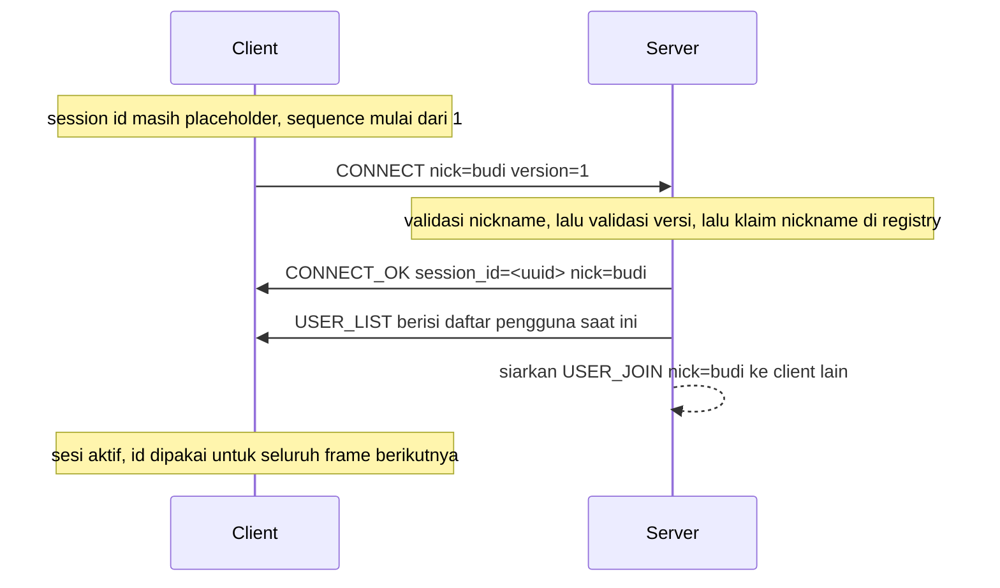

Urutan ini penting dan harus dipatuhi client:

1. Client mengirim `CONNECT` dengan session id placeholder dan nomor urut 1.
2. Server memvalidasi nickname, memeriksa versi protokol, lalu mengklaim nickname di registry. Klaim nama adalah langkah yang menentukan pemenang bila dua koneksi berebut nama yang sama.
3. Setelah klaim berhasil, server membuat session id, mengikatnya ke sesi, dan mengirim `CONNECT_OK`. Nomor urut keluar milik server juga mulai dari 1, sehingga `CONNECT_OK` adalah frame pertama yang diterima client pada sesi tersebut.
4. Server langsung mengirim `USER_LIST` pada koneksi yang sama. Client yang hanya membaca satu frame setelah handshake harus siap menerima daftar ini.
5. Server menyiarkan `USER_JOIN` ke setiap client lain yang sudah terautentikasi, tetapi tidak ke client yang baru bergabung.

### 8.3 Penolakan handshake

Setiap penolakan dijawab dengan `CONNECT_ERR` yang membawa kode mesin, lalu koneksi ditutup. Urutan pemeriksaannya adalah: frame dapat didekode, tipenya benar, payload-nya sah, versinya cocok, namanya belum dipakai.

| Kondisi | Balasan |
| --- | --- |
| Frame pertama bukan JSON atau bukan amplop yang sah | `CONNECT_ERR` dengan `MALFORMED` |
| Frame pertama sah, tetapi tipenya bukan `CONNECT` | `CONNECT_ERR` dengan `UNEXPECTED_TYPE` |
| Payload `CONNECT` tidak sah, misalnya nickname berspasi | `CONNECT_ERR` dengan `NICK_INVALID` |
| `version` bukan `PROTOCOL_VERSION` | `CONNECT_ERR` dengan `PROTOCOL_MISMATCH` |
| Nickname sudah dipakai sesi aktif | `CONNECT_ERR` dengan `NICK_TAKEN` |
| Jumlah koneksi sudah mencapai `max_clients` | Tidak ada balasan; socket dibatalkan |

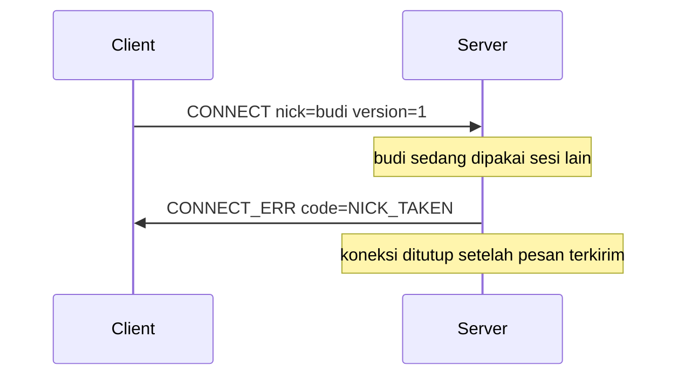

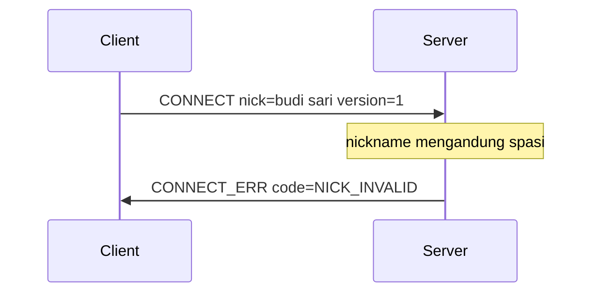

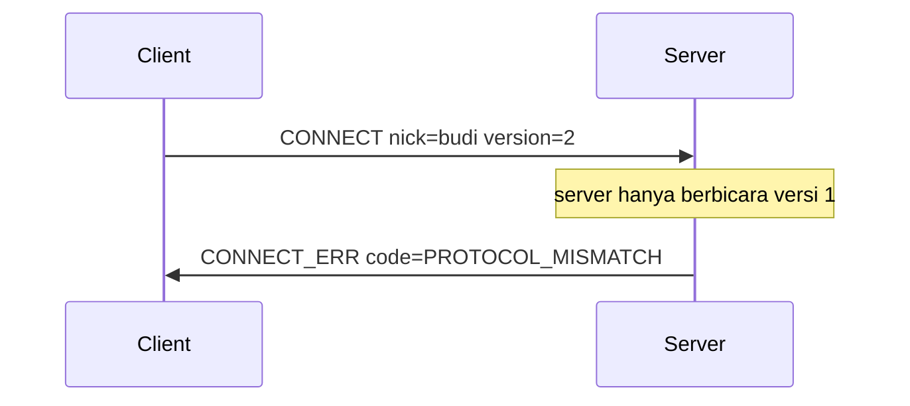

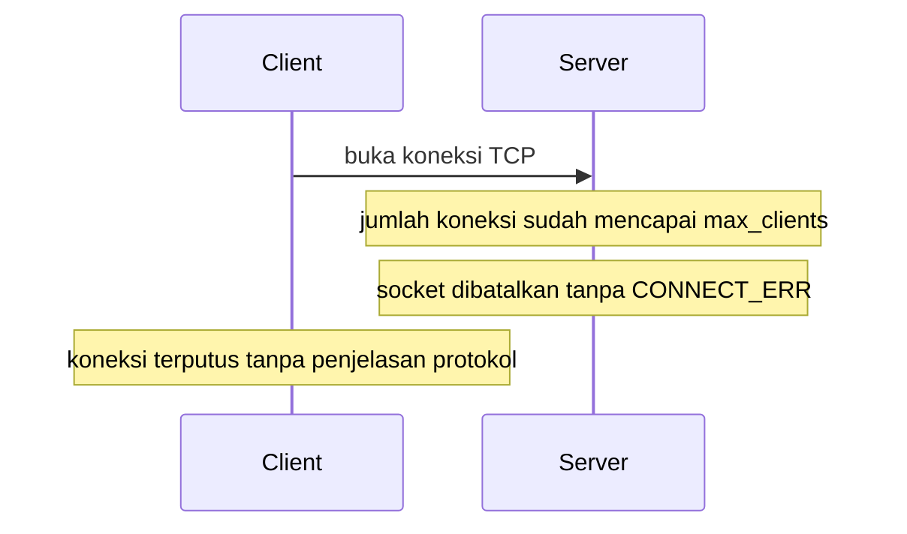

Frame pertama yang tidak dapat didekode tidak diberi jatah frame malformed, berbeda dengan frame malformed saat runtime. Alasannya, peer yang tidak dapat menghasilkan `CONNECT` yang terbaca tidak akan membaik dengan diberi tahu byte mana yang salah, jadi ia dijawab sekali lalu dijatuhkan.

## 9. Alur interaksi

### 9.1 Broadcast

`BROADCAST` dikirim ke setiap pengguna yang sudah terautentikasi, termasuk pengirimnya sendiri. Salinan untuk pengirim itu yang membuat transkrip pengguna lengkap: client yang merender pesannya sendiri secara lokal akan menampilkan pesan sebelum server menerimanya, dan itu berbohong tentang status pengiriman.

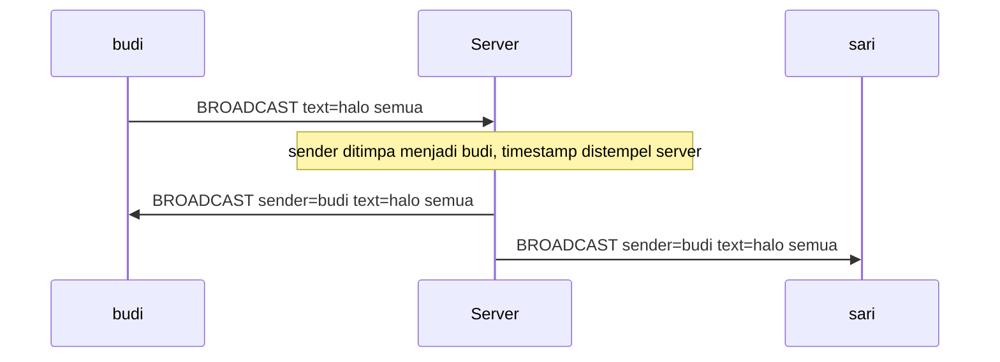

### 9.2 Pesan pribadi

`PRIVATE` memiliki asimetri yang disengaja pada payload. Salinan untuk pengirim membawa field `to`, sedangkan salinan untuk penerima tidak. Field `to` itulah yang membuat client dapat membedakan pesan keluar dari pesan masuk tanpa menyimpan riwayatnya sendiri.

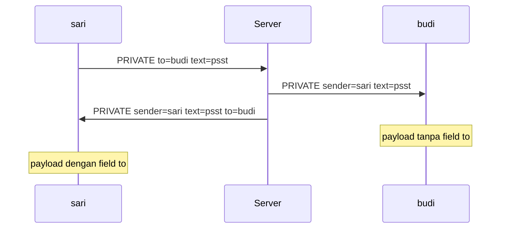

Jika pengirim mengirim pesan pribadi kepada dirinya sendiri, pesan itu tetap hanya muncul satu kali. Bila tujuan tidak ditemukan, server tidak menjatuhkan pesan diam-diam, melainkan membalas `ERROR` dengan `NO_SUCH_USER`.

### 9.3 Rename

Rename bukan handshake kedua. Session id dan ruang nomor urut tidak berubah; yang berubah hanya nama tampilan di registry. Perubahan itu diumumkan ke pengguna lain sebagai pasangan `USER_LEAVE` lalu `USER_JOIN`, bukan sebagai tipe pesan khusus, supaya client yang hanya mengenal tipe pesan dasar tetap merendernya dengan benar: satu pengguna pergi, satu pengguna datang.

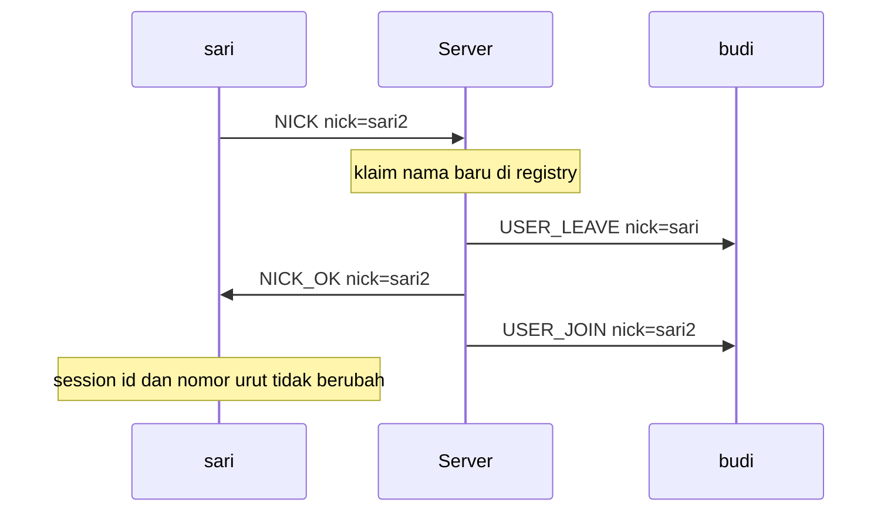

Tiga kasus lain pada rename:

- Nama tujuan sudah dipakai sesi lain: server membalas `ERROR` dengan `NICK_TAKEN` dan `field` bernilai `"nick"`, dan nama lama tetap berlaku.
- Nama yang diminta sama persis dengan nama sekarang: server hanya membalas `NICK_OK` tanpa menyentuh registry, sehingga pengulangan perintah rename bukan kesalahan.
- Nama tidak lolos validasi: server membalas `ERROR` dengan `NICK_INVALID` dan `field` bernilai `"nick"`.

Reservasi nama juga berpindah bersama rename. Nama baru langsung dipegang, nama lama langsung bebas, sehingga sesi baru dapat memakai nama lama dan tidak dapat memakai nama baru.

### 9.4 Putus yang sopan

Client yang pergi dengan baik mengirim `DISCONNECT`. Server juga mengirim `DISCONNECT` kepada setiap client ketika dirinya dimatikan, dan urutannya penting: pesan dimasukkan ke antrean, writer diminta menyelesaikan antreannya, baru kemudian socket dibatalkan. Menutup socket lebih dulu akan membuat pesan perpisahan tidak dapat ditulis dan mengubah shutdown yang tertib menjadi gelombang kesalahan connection reset di sisi client.

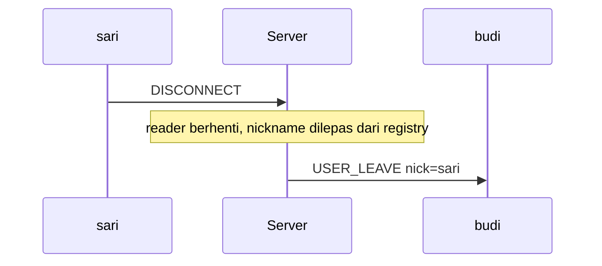

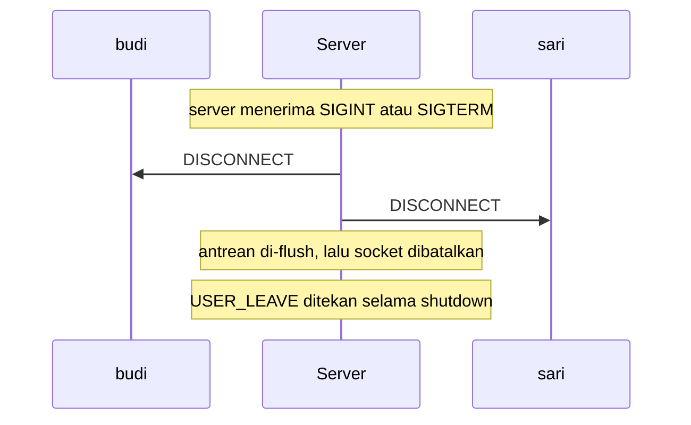

### 9.5 Putus mendadak

Client yang crash atau kabelnya dicabut tidak mengirim apa pun. Socket hilang, dan server mengenalinya dari EOF atau dari RST yang muncul sebagai kesalahan koneksi. Bagi pengguna lain hasilnya sama: sebuah `USER_LEAVE`.

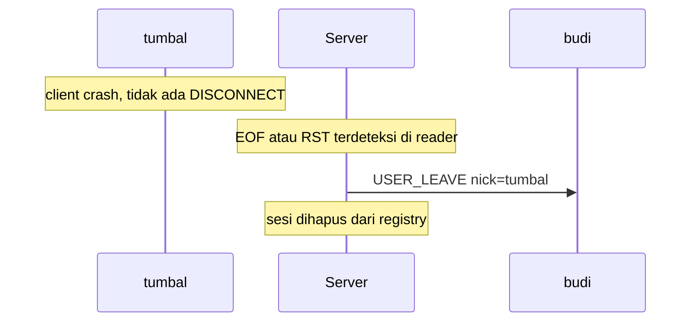

Pelepasan nickname memeriksa identitas pemegangnya. Hanya pengumuman yang berasal dari sesi yang masih memegang nama itu yang diteruskan, sehingga pembersihan basi dari sesi lama tidak akan mengusir atau mengumumkan kepergian penghuni baru yang sudah mengambil alih nama tersebut.

## 10. Heartbeat

TCP tidak memberi tahu dengan cepat bahwa peer sudah hilang. Bila sebuah mesin kehilangan daya atau jaringannya putus, socket tetap terbuka dan tetap dapat ditulisi dari sudut pandang lokal, dan kernel tidak menyelidikinya selama kurang lebih dua jam secara default. Dalam demo, keadaan itu tidak dapat dibedakan dari "belum ada pesan yang datang". Karena itu liveness diperiksa di lapisan aplikasi, di mana waktunya dapat ditentukan sendiri dan hasilnya terlihat di trace.

Kebijakan bawaan adalah `DEFAULT_HEARTBEAT_INTERVAL = 15.0` detik dan `DEFAULT_HEARTBEAT_TIMEOUT = 45.0` detik. Timeout sengaja tiga kali interval supaya dua PING berturut-turut boleh hilang sebelum koneksi dibongkar. Pada entry point client dan server, timeout diturunkan dari interval yang dikonfigurasi lewat `HEARTBEAT_TIMEOUT_FACTOR = 3.0`, sehingga mengubah interval juga menggeser batas waktunya secara proporsional.

Arah probingnya perlu dinyatakan dengan tegas: **client yang mengirim PING, server yang menjawab PONG**. Tidak ada loop di sisi server yang memancarkan PING sendiri.

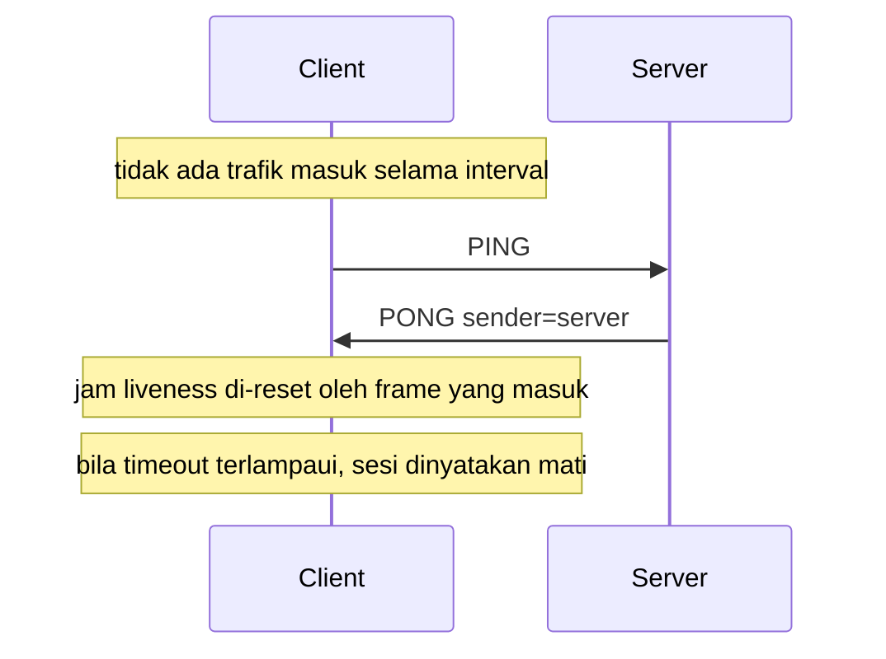

Rinciannya di kedua sisi:

- **Client.** Reader thread melakukan polling dengan timeout sepanjang `interval`. Saat timeout habis, ia memeriksa `peer_expired` lebih dulu; bila sudah lewat batas, sesi dinyatakan mati dan thread berhenti dengan alasan "server tidak merespons". Bila belum, ia memeriksa `ping_due` dan mengirim satu PING. Monitor mencatat waktu trafik keluar dan trafik masuk secara terpisah, sehingga PING dikirim berdasarkan lamanya diam keluar dan peer dinyatakan mati berdasarkan lamanya diam masuk.
- **Server.** `_dispatch` menjawab setiap `PING` dengan `PONG` kosong dan pengirim `"server"`. Server memang memiliki `HeartbeatPolicy` pada `ServerConfig` dan `HeartbeatMonitor` di dalam `SessionCore`, tetapi reader loop-nya menunggu frame tanpa batas waktu, sehingga server tidak memutus koneksi karena heartbeat kedaluwarsa; koneksi berakhir ketika socket tertutup atau ketika frame tidak dapat diproses.
- **Client saat menerima PING.** `ClientSession.receive` menjawab `PING` yang masuk dengan `PONG` secara otomatis dan tidak meneruskannya ke pemanggil. Heartbeat adalah urusan lapisan sesi, dan lapisan aplikasi yang harus tahu soal itu berarti abstraksinya bocor.

Bridge memakai kebijakan yang sama dengan faktor timeout yang sama, sehingga kedua ujungnya memberi waktu pada jadwal yang seragam dan sebuah demo tidak berakhir dengan satu pihak masih mengira pihak lain ada.

## 11. Penanganan error

### 11.1 Nickname duplikat

Nickname diklaim di registry dengan operasi yang mengembalikan `None` bila nama sudah dipegang sesi lain, dan klaim itu adalah langkah atomik yang memutuskan siapa yang menang. Session id baru dibuat setelah klaim berhasil, karena id bergantung pada hasil klaim tersebut.

- Saat handshake, kekalahan dijawab `CONNECT_ERR` dengan `NICK_TAKEN`.
- Saat rename, kekalahan dijawab `ERROR` dengan `NICK_TAKEN` dan `field` bernilai `"nick"`.

### 11.2 Nickname tidak valid

Nickname tidak sah ditolak di dua tempat dengan aturan yang sama. Client menolaknya lebih dulu sebagai kenyamanan, sehingga pengguna tidak perlu menunggu satu putaran jaringan untuk mengetahui kesalahannya. Server menolaknya lagi sebagai penegakan yang sesungguhnya, karena client mentah atau client buatan pihak lain tidak dapat dipercaya.

- Saat handshake, balasannya `CONNECT_ERR` dengan `NICK_INVALID`.
- Saat rename, balasannya `ERROR` dengan `NICK_INVALID` dan `field` bernilai `"nick"`.

### 11.3 Pesan malformed

Ada dua kelas kegagalan yang berbeda, dan keduanya diberi kode yang sama tetapi penanganannya berbeda menurut konteksnya:

- **Tidak dapat dibaca.** Byte bukan UTF-8 yang sah, bukan JSON yang sah, atau JSON-nya bukan objek. Ini kegagalan codec.
- **Terbaca tetapi bukan pesan protokol.** JSON-nya sah, tetapi amplopnya salah: field wajib hilang, ada field asing, `payload` bukan objek, `timestamp` bukan format yang benar, atau `type` bukan string.

Saat runtime, frame yang batasnya masih utuh tetapi isinya rusak diberi jatah `DEFAULT_MALFORMED_BUDGET = 3`. Satu frame buruk masih dapat dipulihkan karena awalan panjang masih membatasi frame itu, sehingga aliran byte masih sinkron. Selama jatah belum habis, server membalas `ERROR` dengan `MALFORMED` dan pesan "could not decode the previous frame", lalu melanjutkan membaca. Ketika hitungannya mencapai batas, server membalas `ERROR` dengan `MALFORMED` dan pesan "too many malformed frames", lalu menutup koneksi. Rangkaian frame buruk berarti peer tidak berbicara protokol ini, dan terus menebak batas frame adalah cara sebuah parser menjadi desinkron lalu membaca sampah.

Hal yang sama berlaku untuk frame yang amplopnya sah tetapi membawa session id yang salah, termasuk placeholder sebelum handshake. Header sesi adalah yang mengikat sebuah PDU ke sesi yang dinegosiasikan, sehingga menerima frame dengan id milik orang lain akan membuat header itu sekadar hiasan. Frame seperti ini dihitung ke dalam jatah yang sama.

### 11.4 Pengguna tujuan tidak ada

Pesan pribadi yang dialamatkan ke nickname yang tidak sedang online tidak dijatuhkan diam-diam. Server membalas `ERROR` dengan `NO_SUCH_USER` dan `field` bernilai `"to"`, sehingga pengirim tahu pesannya tidak sampai. Tujuan yang hilang atau bukan string tidak kosong juga ditolak, dengan pesan bahwa `payload.to` harus berupa string tidak kosong.

### 11.5 Frame terlalu besar

Frame yang panjangnya diumumkan melebihi `MAX_FRAME_SIZE` ditolak hanya dari awalannya, sebelum muatannya ditampung. Penolakan ini fatal, dan alasannya bukan sekadar keamanan memori: batas frame sudah tidak dapat dipercaya. Angka panjang yang kebesaran itu masih duduk di dalam aliran, dan pembacaan berikutnya akan salah mengira angka itu sebagai awalan panjang frame selanjutnya. Karena aliran tidak lagi dapat disinkronkan, server membalas `ERROR` dengan `FRAME_TOO_LARGE` lalu berhenti membaca, dan koneksi ditutup setelah pesan itu sempat terkirim.

### 11.6 Tipe pesan tak dikenal

String `type` yang bukan anggota `MessageType` menggagalkan validasi amplop, dan kegagalan itu dilaporkan sebagai frame malformed. Untuk tipe yang sah tetapi tidak ditangani dispatcher, server membalas `ERROR` dengan `UNKNOWN_TYPE` dan `field` bernilai `"type"`. Batas frame tetap utuh, sehingga koneksi dapat dilanjutkan.

### 11.7 Pesan di luar urutan atau keadaan

Ada beberapa pelanggaran urutan dan keadaan, masing-masing dengan diagnosisnya sendiri:

- **Trafik sebelum autentikasi.** Dispatcher memeriksa status autentikasi sebelum memanggil handler, sehingga peer yang melewatkan handshake tidak dapat menyiarkan pesan dan tidak dapat membaca daftar pengguna. Balasannya `ERROR` dengan `NOT_AUTHENTICATED` dan `field` bernilai `"type"`.
- **Tipe yang salah arah.** Client yang mengirim `CONNECT_OK`, misalnya, dijawab `ERROR` dengan `UNEXPECTED_TYPE` dan `field` bernilai `"type"`. Kode ini sengaja dibedakan dari `UNKNOWN_TYPE` karena diagnosisnya berbeda: arah yang salah bukan berarti pesannya tidak dikenal.
- **Frame pertama bukan `CONNECT`.** Saat handshake, balasannya `CONNECT_ERR` dengan `UNEXPECTED_TYPE`.
- **Session id tidak cocok.** Frame yang amplopnya sah tetapi membawa session id lain, termasuk placeholder, dihitung sebagai frame malformed dan mengikuti jatah yang sama.
- **Nomor urut melompat.** Ini tidak memutus koneksi. Anomali dihitung dan dilaporkan ke trace, karena TCP sudah menjamin urutan sehingga lompatan adalah sinyal bug yang nyata, dan satu PDU aneh tidak seharusnya membunuh sesi.

### 11.8 Isi obrolan terlalu panjang

Isi obrolan dibatasi `MAX_TEXT_LENGTH = 4096` karakter. Teks yang melebihi batas itu menghasilkan pelanggaran skema yang membawa kode `TEXT_TOO_LONG`, dan server meneruskannya sebagai `ERROR` dengan kode tersebut, bukan sebagai `MALFORMED`. Perbedaannya penting: pesan itu terbaca sempurna, hanya saja terlalu panjang, sehingga kode yang lebih spesifik memberi tahu pengguna apa yang harus dipersingkat. Teks yang kosong atau hanya berisi whitespace juga ditolak.

### 11.9 Client putus mendadak

Kematian mendadak tidak menghasilkan error apa pun untuk peer, karena tidak ada peer yang tersisa untuk menerimanya. Yang terjadi di server adalah deteksi EOF atau RST, pembersihan di blok `finally`, pelepasan nickname dari registry, dan penyiaran `USER_LEAVE` ke pengguna yang masih tersisa. Pelepasan itu memeriksa identitas pemegang nama, sehingga pembersihan basi dari sesi lama tidak akan mengusir atau mengumumkan kepergian penghuni baru yang sudah mengambil alih nama tersebut.

Selama shutdown server berlangsung, `USER_LEAVE` untuk setiap koneksi ditekan. Semua orang pergi bersamaan dan sudah diberi tahu lewat `DISCONNECT`, sehingga satu pengumuman per koneksi hanya akan menjadi derau tentang daftar pengguna yang sudah tidak ada.

## 12. Batas protokol

Tabel berikut merangkum setiap konstanta yang membatasi perilaku protokol, beserta nilainya dan lokasinya di kode.

| Konstanta | Nilai | Lokasi | Arti |
| --- | --- | --- | --- |
| `PROTOCOL_VERSION` | `1` | `session/handshake.py` | Revisi protokol yang didukung |
| `SESSION_HEADER_SIZE` | `24` | `session/envelope.py` | Ukuran header sesi dalam byte |
| `UNASSIGNED_SESSION_ID` | `"00000000-0000-0000-0000-000000000000"` | `session/envelope.py` | Placeholder id sebelum handshake |
| `MAX_SEQUENCE` | `2^64 - 1` | `session/envelope.py` | Batas atas nomor urut |
| `LENGTH_PREFIX_SIZE` | `4` | `transport/framing.py` | Lebar awalan panjang dalam byte |
| `MAX_FRAME_SIZE` | `64 * 1024` (65536) | `transport/framing.py` | Batas muatan frame setelah awalan |
| `READ_CHUNK_SIZE` | `65536` | `transport/channel.py` | Byte yang diminta per operasi baca |
| `DEFAULT_CONNECT_TIMEOUT` | `10.0` | `transport/channel.py` | Batas waktu TCP connect, dalam detik |
| `MAX_TEXT_LENGTH` | `4096` | `presentation/schema.py` | Batas panjang isi obrolan, dalam karakter |
| `MIN_NICKNAME_LENGTH` | `1` | `presentation/schema.py` | Batas bawah panjang nickname |
| `MAX_NICKNAME_LENGTH` | `24` | `presentation/schema.py` | Batas atas panjang nickname |
| `DEFAULT_HEARTBEAT_INTERVAL` | `15.0` | `session/heartbeat.py` | Detik diam sebelum mengirim PING |
| `DEFAULT_HEARTBEAT_TIMEOUT` | `45.0` | `session/heartbeat.py` | Detik tanpa trafik masuk sebelum peer dianggap mati |
| `HEARTBEAT_TIMEOUT_FACTOR` | `3.0` | `client/main.py`, `bridge/main.py`, `server/main.py` | Pengali interval menjadi timeout |
| `DEFAULT_MALFORMED_BUDGET` | `3` | `server/chat_server.py` | Frame malformed yang ditoleransi sebelum koneksi ditutup |
| `DEFAULT_SEND_QUEUE_SIZE` | `256` | `server/chat_server.py` | Batas antrean kirim per koneksi |
| `DEFAULT_FLUSH_TIMEOUT` | `1.0` | `server/chat_server.py` | Detik untuk menyelesaikan antrean sebelum socket dibatalkan |
| `DEFAULT_SHUTDOWN_TIMEOUT` | `2.0` | `server/chat_server.py` | Batas waktu penyelesaian handler saat shutdown |
| `DEFAULT_HOST` | `"127.0.0.1"` | `app/config.py` | Alamat default server |
| `DEFAULT_PORT` | `9009` | `app/config.py` | Port default server |
| `DEFAULT_MAX_CLIENTS` | `64` | `app/config.py` | Batas koneksi bersamaan secara default |

Nilai bawaan lain yang relevan tetapi bukan konstanta bernama ada pada `ServerConfig`: `max_clients=64`, `handshake_timeout=10.0`, `send_queue_size=256`, `malformed_budget=3`, `flush_timeout=1.0`, dan `shutdown_timeout=2.0`. Selain itu, codec membatasi proses dekode pada `_DECODE_LIMIT = 64 * 1024` byte, sejalan dengan batas frame di transport, agar awalan panjang yang salah tidak membuat parser JSON berjalan pada string yang tidak terbatas.

### 12.1 Cara memverifikasi klaim di dokumen ini

Dua alat di repositori memperlihatkan byte dan peristiwa yang sesungguhnya, sehingga setiap pernyataan di atas dapat diperiksa sendiri.

- `python tools/frame_dump.py --port 9009 --nick dumper` terhubung ke server yang sedang berjalan, mengirim percakapan berskrip, dan mencetak setiap frame di kedua arah dengan awalan panjang, header sesi, dan isi JSON yang dipisahkan. Ini yang dipakai untuk memperoleh contoh byte di bagian 3.1.
- `python run_server.py --trace` memancarkan trace event per lapisan sebagai JSON lines ke stderr, sehingga urutan L7 sampai L4 untuk satu pesan dapat diikuti pada satu id trace.

Untuk membandingkan perilaku dengan tangkapan jaringan, jalankan server lalu tangkap lalu lintas loopback di Wireshark pada port yang sama. Yang terlihat di sana adalah segmen TCP sungguhan dari stack sistem operasi, dengan muatan yang sama persis dengan yang dicetak kedua alat di atas.
