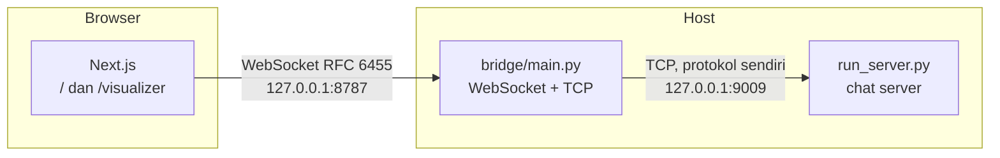

# Klien Web dan Visualizer Lapisan

Dokumen ini menjelaskan bagian `web/`: kenapa ia ada, bagaimana ia berbicara
dengan server chat lewat bridge, dan bagaimana menjalankannya. Untuk protokol
chat di sisi TCP, lihat [`PROTOCOL.md`](PROTOCOL.md). Untuk gambaran seluruh
sistem, lihat [`ARSITEKTUR.md`](ARSITEKTUR.md).

## 1. Kenapa ada klien web

Klien terminal sudah cukup untuk memakai aplikasi ini. Bagian web menambahkan
satu hal yang tidak bisa dilakukan terminal: **menunjukkan lapisan.**

Setiap pesan yang lewat melewati empat lapisan yang kita tulis sendiri, dan
tiap lapisan melaporkan apa yang dikerjakannya. Di terminal, laporan itu muncul
sebagai baris JSON yang langsung tergulung layar. Di browser, laporan yang sama
disusun menjadi tangga L7 sampai L4 per pesan, dengan payload mentahnya bisa
dibuka. Itu yang membuat pekerjaan lapisan bisa diperiksa, bukan sekadar
diklaim.

Bagian web terdiri dari dua halaman:

| Rute | Isi |
| --- | --- |
| `/` | Ruang chat: konek, kirim pesan, lihat user aktif |
| `/visualizer` | Tangga lapisan untuk tiap pesan yang lewat |

## 2. Tiga proses

Browser tidak bisa membuka socket TCP mentah, jadi dibutuhkan satu proses di
tengah yang menerjemahkan dua dunia:



Bridge memegang satu koneksi TCP ke server chat **untuk setiap tab**. Ia tidak
menyimpan keadaan bersama antar tab: dua tab adalah dua user, persis seperti dua
klien terminal.

### Kenapa bridge bukan bagian dari Next.js

Godaan pertama adalah menaruh koneksi TCP langsung di dalam route handler
Next.js. Itu tidak dikerjakan, karena:

- Route handler dirancang untuk request dan response yang pendek. Koneksi TCP
  yang hidup selama sesi chat tidak punya tempat untuk hidup di dalamnya.
- Bridge memakai **stack lapisan yang sama** dengan klien terminal. Ia mengimpor
  `session`, `presentation`, dan `transport` yang sama, jadi perintah seperti
  `/nick` dan `/msg` dijalankan oleh kode yang identik, bukan oleh implementasi
  kedua yang harus dijaga tetap sinkron.
- Proses terpisah bisa dimatikan dan dijalankan ulang tanpa mengganggu satu pun
  koneksi chat yang sedang berjalan.

## 3. Kontrak browser dan bridge

Semua pesan adalah satu objek JSON, dikirim sebagai satu pesan teks WebSocket.

### Browser ke bridge

| `type` | Field | Arti |
| --- | --- | --- |
| `connect` | `nick` | Minta bridge membuka koneksi chat dengan nickname ini |
| `input` | `text` | Satu baris input, sama seperti yang diketik di klien terminal |
| `disconnect` | | Tutup koneksi chat, biarkan WebSocket tetap terbuka |

`input` sengaja menerima baris mentah, bukan pesan yang sudah diurai. Bridge
melewatkannya ke `app.commands.parse_input` dan `app.chat_logic.plan` yang sama
dengan klien terminal, jadi aturan perintah hanya ada di satu tempat.

### Bridge ke browser

| `type` | Field | Arti |
| --- | --- | --- |
| `state` | `state`, `nick`, `sessionId` | Perubahan status sesi chat |
| `line` | `text` | Satu baris siap tampil, sudah dirender bridge |
| `message` | `message` | Amplop terstruktur; web merender percakapan dari sini |
| `trace` | `event` | Satu peristiwa lapisan |
| `error` | `message` | Kesalahan yang perlu dilihat user |

Nilai `state` adalah `connecting`, `connected`, atau `closed`. Field `sessionId`
**hanya ada** saat `connected`, karena id sesi baru diberikan server setelah
handshake berhasil.

`line` dan `message` membawa trafik yang sama dalam dua bentuk. `line` adalah
render teks dari `app.chat_logic`, tetap dipakai klien terminal apa adanya.
Sisi web kini merender percakapan dari `message` (field-nya) dan mengabaikan
`line` remote: menampilkan keduanya berarti setiap pesan tampil dua kali. Yang
masih dipakai web dari `line` hanya output lokal bridge yang tidak punya
amplop: isi `/help`, penolakan nickname, dan perintah tak dikenal.

### Peristiwa lapisan

Isi `event` pada frame `trace`:

| Field | Isi |
| --- | --- |
| `traceId` | Pengenal yang menyatukan semua peristiwa dari satu pesan |
| `sessionId` | Sesi pemilik peristiwa |
| `direction` | `outbound` atau `inbound` |
| `layer` | `7`, `6`, `5`, atau `4` |
| `layerName` | `Application`, `Presentation`, `Session`, `Transport` |
| `pduType` | `data`, `message`, atau `segment` |
| `node` | `client`, `server`, atau `bridge` |
| `summary` | Satu baris penjelasan apa yang dilakukan lapisan itu |
| `payloadPreview` | Cuplikan payload yang bisa dibaca |
| `payloadHex` | Payload mentah dalam heksadesimal |
| `sizeBytes` | Ukuran payload |
| `timestamp` | Waktu kejadian |

Bridge selalu memasang sink jejak ke setiap tab, jadi tidak ada flag yang perlu
dinyalakan supaya visualizer menerima data.

## 4. Jejak masuk berhenti di L6

Ini disengaja, dan mudah disalahartikan sebagai bug.

Pesan yang **dikirim** dilaporkan oleh keempat lapisan: L7, L6, L5, L4. Pesan
yang **diterima** berhenti di L6. Sebabnya ada di pembagian tanggung jawab:
`SessionCore.parse_inbound` memutuskan apa yang boleh dikirim kapan, membuka
amplop L5, dan menerjemahkan JSON di L6. Lapisan L7 di sisi penerima bukan
urusan `SessionCore`, melainkan urusan pemakai stack, yaitu klien terminal atau
bridge. Karena tidak ada yang melaporkannya, tidak ada yang bisa ditampilkan.

Mengarang satu baris L7 di sana akan membuat visualizer berbohong. Dua pengujian
mengunci kontrak ini:

- `tests/test_trace.py` `FullStackTraceOrderTests.test_inbound_message_files_l4_l5_l6_in_order`
- `tests/test_session.py` `TraceOrderTests.test_inbound_emits_session_then_presentation`

## 5. Konfigurasi

Tidak ada alamat atau port yang ditulis di dalam kode. Nilai dibaca dari
variabel lingkungan dengan nilai bawaan yang sama dengan sisi Python.

| Variabel | Bawaan | Dipakai oleh |
| --- | --- | --- |
| `NEXT_PUBLIC_CHAT_BRIDGE_HOST` | `127.0.0.1` | Halaman web, alamat bridge |
| `NEXT_PUBLIC_CHAT_BRIDGE_PORT` | `8787` | Halaman web, port bridge |

Awalan `NEXT_PUBLIC_` diperlukan karena nilai ini dibaca di browser. Isinya
ditanam saat build, jadi mengubahnya berarti membangun ulang, bukan sekadar
me-restart.

Sisi bridge punya pasangan variabelnya sendiri, `CHAT_BRIDGE_HOST` dan
`CHAT_BRIDGE_PORT`, supaya ia bisa didengarkan di alamat lain tanpa mengubah
kode.

## 6. Menjalankan

Server chat dan bridge berjalan di Python. Halaman web berjalan di Node.

```bash
# 1. Server chat
python run_server.py --port 9009

# 2. Bridge
python -m bridge.main --port 9009 --ws-port 8787

# 3. Halaman web
cd web
npm install
npm run dev
```

Buka `http://localhost:3000`.

Untuk mode produksi, ganti langkah ketiga dengan:

```bash
cd web
npm run build
npm run start -- -p 3000
```

Kalau bridge dipindahkan ke port lain, beri tahu sisi web lewat variabel
lingkungan:

```bash
NEXT_PUBLIC_CHAT_BRIDGE_PORT=8899 npm run dev
```

### Kalau halaman tidak bisa terhubung

Gejalanya adalah pesan kesalahan yang menyebut alamat bridge. Yang diperiksa,
berurutan:

1. Apakah `python -m bridge.main` benar-benar berjalan.
2. Apakah portnya sama dengan yang diharapkan halaman web.
3. Apakah server chat berjalan. Bridge akan menolak koneksi browser kalau ia
   sendiri tidak bisa mencapai server chat, dan pesan errornya menyebut alasan
   dari server.

## 7. Satu sesi per tab

Provider koneksi dipasang di `web/app/layout.tsx`, bukan di masing-masing
halaman. Ini yang membuat perpindahan dari `/` ke `/visualizer` tidak memutus
apa pun: satu WebSocket, satu sesi chat, satu aliran jejak, dipakai bersama
kedua halaman.

Konsekuensinya, dan ini perilaku yang benar:

- **Navigasi antar halaman tidak memutus sesi.** Trace yang sudah terkumpul
  tetap ada.
- **Muat ulang penuh memutus sesi.** Provider dibongkar, WebSocket ditutup,
  bridge menutup koneksi TCP-nya, dan jejak dikosongkan. Nickname dilepas
  kembali ke server dalam waktu di bawah satu detik, jadi bisa langsung dipakai
  lagi.

WebSocket dibuka saat provider dipasang, bukan saat user menekan tombol masuk.
Ini supaya `/visualizer` bisa dibuka lebih dulu dan tetap menampilkan jejak
selagi pesan datang. Nickname baru diklaim ke server ketika user benar-benar
menekan tombol masuk.

## 8. Struktur folder

```
web/
├── app/
│   ├── layout.tsx           Provider koneksi, navigasi, bootstrap tema
│   ├── globals.css          Token warna dan aturan dasar
│   ├── page.tsx             Ruang chat
│   └── visualizer/page.tsx  Visualizer lapisan
├── components/
│   ├── ConnectBar.tsx       Form konek, daftar user, pemberitahuan error
│   ├── MessageLog.tsx       Transkrip bubble dan input perintah
│   ├── SiteNav.tsx          Navigasi antar halaman
│   ├── ThemeToggle.tsx      Sakelar tema
│   └── TraceLadder.tsx      Tangga lapisan per pesan
└── lib/
    ├── bridge.tsx           Provider, hook useBridge, timeline transkrip
    ├── messages.ts          Bentuk amplop, waktu, dan notis sistem
    └── trace.ts             Bentuk peristiwa, warna lapisan, pengelompokan
```

## 9. Catatan tampilan

Tema bawaan adalah gelap, dengan sakelar ke tema terang. Pilihannya disimpan di
`localStorage` dengan kunci `jarkom-theme`; tanpa pilihan tersimpan, tema
mengikuti preferensi sistem.

Empat warna lapisan pada visualizer adalah **kunci data**, bukan hiasan: warna
itu yang menghubungkan baris pada tangga dengan baris pada ringkasan jumlah per
lapisan. Semuanya diperiksa terhadap kontras minimum WCAG AA, dan nilai
terendahnya adalah 5.64 banding 1.
